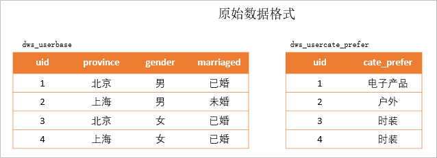
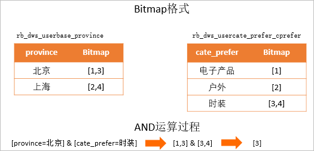
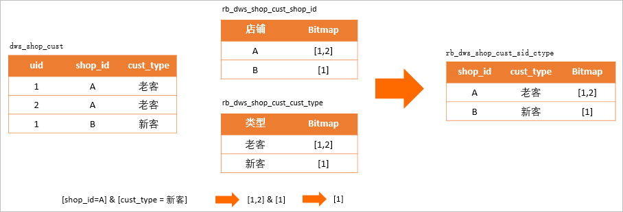

当业务标签越来越多时（大于1000列），一般就认为是超大规模的场景，宽表标签计算的方案将不再适合，因为当列越多时，更新效率将会越慢。通过对标签表构建索引，将用户ID编码后以Bitmap格式保存，将关系运算转化Bitmap的交并差运算，进而加速实时计算性能。在超大规模用户属性洞察分析的场景中，使用RoaringBitmap组件能够实现亚秒级的查询响应。

## 1. 适用场景

使用 RoaringBitmap 的方案的可以适用于如下场景：
- 标签数量多：需要对多张大表进行关联运算，可以使用 BITMAP_AND 替换 JOIN 运算，可以降低内存消耗，Bitmap 使用 SIMD 指令优化可以将 CPU 使用率提升1~2个数量级。
- 数据规模大且需去重运算：如数十亿数据需要去重，Bitmap 结构天然去重，避免精确 UV 计算和内存的开销。

## 2. 标签数据分类

在介绍 Bitmap 计算方案之前，我们需要区分画像系统中常用的两类标签数据，针对这两类数据的计算模式大相径庭，我们需要依据数据模型和运算模式将合理的部分转化为Bitmap格式存储。
- 属性标签：主要描述用户的属性情况，例如用户性别、所在省份、已婚状态等，数据相对稳定，通常进行精准条件过滤。这类数据进行Bitmap压缩比会很高，且Bitmap适合对应的运算。
- 行为标签：主要描述用户行为特征，描述用户在某个时间做了一件什么事，比如用户店铺浏览购买行为、用户登录活跃行为等，数据变更频率高，通常需要进行范围扫描，聚合过滤。这类数据不适合进行Bitmap压缩，压缩比会很差，运算模式不适合Bitmap直接运算。

## 3. 属性标签处理

属性标签处理场景通常是描述用户的属性情况，数据相对稳定，通常进行精准条件过滤，通过Bitmap能实现高效的压缩和运算。

### 3.1 方案介绍

假设现有的DMP（Data Management Platform）系统中存在两张属性标签表，如下图所示。



dws_userbase 表描述用户基础属性，dws_usercate_prefer 表描述用户偏好。

典型的人群人数预估的场景比如计算 `[province = 北京] & [cate_prefer = 时装]` 的人数，通常可以关联、过滤、去重最终获得人数。但在数据规模较大的场景，关联、去重运算会带来严重的性能负担。

Bitmap优化方案通过预构建标签的Bitmap表来减少即席运算的成本，比如将两张表中的列拆开分别构建Bitmap表如下图所示，通过两表中对应Bitmap的与运算计算出人数。



rb_dws_userbase_province 表描述省份和 uid 的 Bitmap 关系，rb_dws_usercate_prefer_cprefer 描述类目和 uid 的 Bitmap 关系。

但是按列拆分的方案也存在一定的问题，当多列之间存在层级的组织关系时，上述的拆分和运算方式可能会导致计算错误的情况，如下图所示。



在描述店铺用户新客、老客、潜客信息的dws_shop_cust表中，按照列拆分成描述店铺名称的Bitmap表rb_dws_shop_cust_shop_id，描述客户类型的Bitmap表rb_dws_shop_cust_cust_type。当计算 `[shop_id = A] & [cust_type = 新客]` 的人群集合，会得到 `[1]` 的uid集合，然而在真实的表中这条数据不存在。产生这种错误的原因是cust_type、shop_id两个字段存在一定的关联性，在数仓模型中cust_type是shop_id维度的指标数据，脱离统计维度单独使用指标是错误的。因此可以将维度shop_id和指标cust_type组合值作为构建Bitmap的单元，生成rb_dws_shop_cust_sid_ctype表来避免这类错误。

根据以上方案介绍，需要将uid压缩存储进Bitmap，通过Bitmap与或非运算实现标签的对应运算。

### 3.2 方案实践

#### 3.2.1 用户信息编码处理

用户标识可能是字符类型的，由于Bitmap只能保存整数信息，因此需要先将uid进行整数编码。对用户标识进行编码不仅可以方便存储进Bitmap，还可以使ID信息保持连续性。如下图所示bitmap2由于存储的ID数据稀疏，存储效率相比bitmap1低很多，因此对ID编码处理，也会降低存储成本，提升运算效率。


对于数值类型，如果较为稀疏也可以考虑编码，但是进行编码有利有弊，例如在广告DMP系统中除了需要高性能的画像能力，也需要实时输出人群明细的能力；而一旦需要输出人群明细，就需要Join用户ID表进行还原，这一部分的性能开销，也应当纳入技术选型的考虑因素中。因此您可以依据使用场景权衡选择，是否进行编码建议如下：
- 字符ID：建议编码。
- 整数ID且需要频繁还原原始值：建议不编码。
- 整数ID且不需要还原原始值：建议编码。

#### 3.2.2 Bitmap 加工和查询

依据上述方案按列拆分的思路，将dws_userbase表与dws_shop_cust表进行拆分，按照分别为省份、性别的列Bitmap拆分为一个表，但是性别只有男、女两个选项，压缩出来的Bitmap只能分布于集群中的两个节点，计算存储都很不平均，集群的资源并不能充分利用。因此有必要将Bitmap拆分成多段，并将它们打散到集群中来提升并发执行的能力，假设将Bitmap打散成65536段，SQL命令如下。


当进行 `[shop_id = A] & [cust_type = 新客] & [province = 北京]` 的客群人数预估时，按照标签的与或非逻辑组织对应的Bitmap关系运算，即可完成对应的查询，SQL命令如下。
```sql
SELECT SUM(RB_CARDINALITY(rb_and(ub.bitmap, uc.bitmap)))
FROM
  (SELECT rb_or_agg(bitmap) AS bitmap,
          bucket
   FROM rb_dws_userbase_province
   WHERE province = '北京'
   GROUP BY bucket) ub
JOIN
  (SELECT rb_or_agg(bitmap) AS bitmap,
          bucket
   FROM rb_dws_shop_cust_sid_ctype
   WHERE shop_id = 'A'
     AND cust_type = '新客'
   GROUP BY bucket) uc ON ub.bucket = uc.bucket;
```

## 4. 行为标签处理

常见的实时表往往包含时间维度，比如按天汇总的用户行为实时表。就某一天的数据而言，用户的数据仅包含有限几条数据。由于Bitmap本身存在结构行存储开销，压缩成Bitmap不但不能节省存储空间，更可能造成存储浪费。另一方面，事实表典型的计算模式中需要汇总多天数据进行聚合过滤，如果使用Bitmap存储可能需要展开再汇总运算。同时由于这类数据变更频繁，有时更需要实时更新；在[option->bitmap]的存储结构中，无法直接找到需要更新的数据。因此Bitmap并不适合用于压缩行为数据，不适合进行汇总运算，不适合实时更新。

当涉及到行为标签数据处理的场景时，在Hologres中可以保持原有的存储格式。当发生事实表与属性表联合运算时，可以将实时表过滤结果实时生成Bitmap，再与属性表Bitmap索引进行运算。同时由于Bitmap索引表使用Bucket作为分布键（Distribution Key），通过Local Join提升性能。

当我们计算[province=北京] & [shop_id=A且7天未购买]的用户时，SQL命令如下所示。

## 5. 离线Bitmap处理方案

为了避免Bitmap数据计算对生产业务的影响，可以选择在离线完成Bitmap数据的加工，通过Hologres外部表能力从MaxCompute或者Hive中直接加载数据。离线处理Bitmap的过程与在线流程思路类似，也可以通过编码、聚合方式产生数据，在MaxCompute中离线构建Bitmap数据示例如下。


> [画像分析 - RoaringBitmap优化方案](https://www.alibabacloud.com/help/zh/hologres/use-cases/roaring-bitmaps?spm=a2c63.p38356.0.0.5b0813d7h5WDXZ)

。。。
