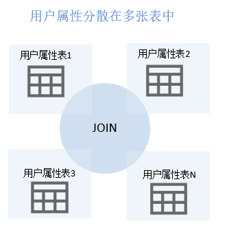
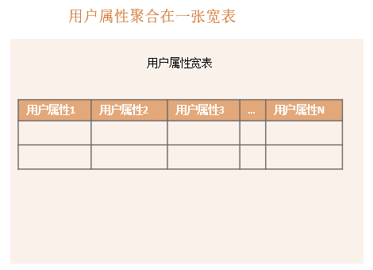
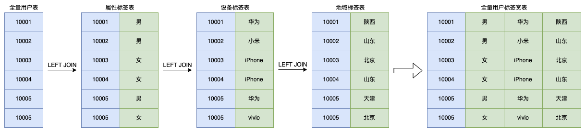

## 1. 画像宽表

离线数仓模型中，画像标签数据被分隔成面向主题、维度的多张标签表，这样的组织形式便于体系化的构建标签系统及数据维护管理：



假设用户的性别标签存储在 `dws_app_user_profile_attr_label_td` 表中，品牌标签存储在 `dws_app_user_profile_device_label_td` 表中，其表结构如下图所示：

| user_id | gender |
| :------------- | :------------- |
| 10001 | 男 |
| 10002 | 男 |
| 10003 | 女 |
| 10004 | 女 |
| 10005 | 男 |
| 10006 | 女 |

> 性别标签数据表 dws_app_user_profile_attr_label_td 示例

| user_id | brand |
| :------------- | :------------- |
| 10001 | 华为 |
| 10002 | 小米 |
| 10003 | iPhone |
| 10004 | iPhone |
| 10005 | 华为 |
| 10006 | vivo |

> 品牌标签数据表 dws_app_user_profile_device_label_td 示例

如果需求从上述两张表中圈选出使用 iPhone 的女性用户，最传统的实现方案是直接通过 INNER JOIN 语句找出两张表中满足条件的用户，其 SQL 语句如下所示：
```sql
SELECT a1.user_id
FROM (
  SELECT user_id
  FROM dws_app_user_profile_attr_label_td
  WHERE gender = '女'
) a1
INNER JOIN (
  SELECT user_id
  FROM dws_app_user_profile_device_label_td
  WHERE brand = 'iPhone'
) a2
ON a1.user_id = a2.user_id;
```
如果在使用 iPhone 的女性用户的基础上再增加一个筛选条件，比如北京市的用户：

| user_id | prov |
| :------------- | :------------- |
| 10001 | 陕西 |
| 10002 | 山东 |
| 10003 | 北京 |
| 10004 | 山东 |
| 10005 | 天津 |
| 10006 | 北京 |

> 常驻省份标签数据表 dws_app_user_profile_lbs_label_td 示例

按照 SQL 编写逻辑需要再次 INNER JOIN 用户地域标签表 `dws_app_user_profile_lbs_label_td` 限制地域为北京：
```sql
SELECT a1.user_id
FROM (
  SELECT user_id
  FROM dws_app_user_profile_attr_label_td
  WHERE gender = '女'
) a1
INNER JOIN (
  SELECT user_id
  FROM dws_app_user_profile_device_label_td
  WHERE brand = 'iPhone'
) a2
ON a1.user_id = a2.user_id
INNER JOIN (
  SELECT user_id
  FROM dws_app_user_profile_lbs_label_td
  WHERE prov = '北京'
) a3
ON a1.user_id = a3.user_id;
```

随着筛选条件的增加，这个 SQL 语句的长度和执行时间会逐渐增大，代码维护也越来越复杂。如果在线画像分析服务按照这样的数据模型组织标签数据，不可避免的需要 Join 多张标签表来完成多标签的过滤，这对于数据库产品开销太大。我们可以将相对稳定的标签表离线聚合成宽表，将多张表的关联操作转化成对一张表的过滤计算，新的标签列的场景可以通过增加列的方式实现：



常见的画像宽表表结构设计如下图所示，其中包含的关键元素主要是日期分区 dt，画像标签主键用户ID user_id 以及各画像标签列。日期分区用于区分不同时间下的标签取值，每个分区中都包含全量用户数据。画像宽表的创建语句如下代码所示：
```sql
CREATE TABLE IF NOT EXISTS `dws_app_user_profile_label_td`(
  `user_id` bigint COMMENT '用户ID',
  `gender` string COMMENT '性别',
  `brand` string COMMENT '品牌',
  `prov` string COMMENT '常驻省份',
  ...
)
COMMENT '画像标签宽表'
PARTITIONED BY (`dt` string COMMENT '日期-yyyyMMdd');
```

将上述需求中所有标签拼接到一张数据表中构建出一张宽表 `dws_app_user_profile_label_td`：

| user_id | gender | brand | prov |
| :------------- | :------------- | :------------- | :------------- |
| 10001 | 男 | 华为 | 陕西 |
| 10002 | 男 | 小米 | 山东 |
| 10003 | 女 | iPhone | 北京 |
| 10004 | 女 | iPhone | 山东 |
| 10005 | 男 | 华为 | 天津 |
| 10006 | 女 | vivo | 北京 |

圈选 SQL 语句可以简化成如下语句：
```sql
SELECT user_id
FROM dws_app_user_profile_label_td
WHERE gender = '女' AND brand = 'iPhone' AND prov = '北京'
```

该语句更加简洁且容易理解，其复杂度也不会随着筛选条件的增多而提高。与传统实现方式相比，基于宽表进行工程开发的难度和维护成本都将降低很多。将数据存在宽表中，多列之间过滤条件的与或非运算将被列存的优化机制自动处理，相比 Join 方式都要更加高效。

## 2. 宽表生成

如何生成画像宽表？最简单直接的方式是通过 SQL 语句来拼接不同标签数据表，下图展示了将多个标签表汇总到画像宽表的主要流程：



全量用户表通过 LEFT JOIN 其他标签表来合并各种标签：
```sql
INSERT OVERWRITE TABLE dws_app_user_profile_label_td PARTITION (dt)
SELECT a1.user_id, a2.gender, a3.brand, a4.prov, '${date}'
FROM (
  -- 全量用户表
  SELECT user_id
  FROM dim_app_base_user_df
  WHERE dt = '${date}'
) a1
LEFT OUTER JOIN (
  SELECT user_id, gender
  FROM dws_app_user_profile_attr_label_td
  WHERE dt = '${date}'
) a2
ON a1.user_id = a2.user_id
LEFT OUTER JOIN (
  SELECT user_id, brand
  FROM dws_app_user_profile_device_label_td
  WHERE dt = '${date}'
) a3
ON a1.user_id = a3.user_id
LEFT OUTER JOIN (
  SELECT user_id, prov
  FROM dws_app_user_profile_lbs_label_td
  WHERE dt = '${date}'
) a4
ON a1.user_id = a4.user_id;
```

## 3. 使用场景

随着业务发展，生产画像宽表所涉及的标签数量逐渐增加，仅通过一条 SQL 语句生成宽表的缺陷逐渐暴露出来。主要会遇到如下问题：
- SQL 语句随着标签的增多会变冗长且结构复杂，在 SQL 中增删改标签的难度增大，提高了维护成本。如果某一次数据合并出错了，找到并修复问题花费的时间成本非常高，且没有办法 100% 的避免类似问题，因为各种数据的数据质量是没有办法 100% 把控，总是会出现各种异常情况。
- 每个标签表的计算完成时间不同，宽表模式会等待所有标签表产出才开始计算，这就造成宽表的产出时间受最晚产出标签的影响，而且在 SQL 执行时涉及所有上游标签数据，其需要大量的计算资源集中进行计算，这无疑会造成宽表的产出时间延长，时效性较低。
- 不同的标签计算频率可能不同，比如说学历一周甚至更长时间计算一次都是可以接受的，但是 APP 登录活跃情况却需要每天都要计算。这样会导致不需要计算的标签每天重复计算，从而造成大量计算资源的浪费。
- 当单个标签数据异常时，需要重跑整个 SQL 语句来纠正数据问题，这无疑造成了资源的浪费。
- 扩展比较麻烦，当新增标签时可以通过增加列的方式来实现，这需要即在 Hive 表中新增字段，同时也会在在线画像分析服务使用的 ClickHouse 中同步增加字段。

综上这种方案适可以适用于以下场景：
- 标签数量较少（小于1000）
- 数据稳定（更新较少）
