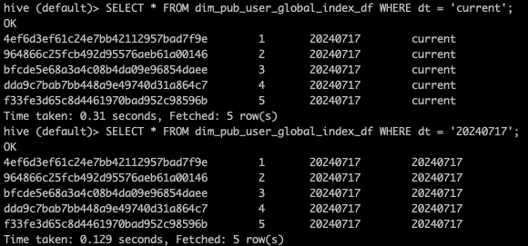
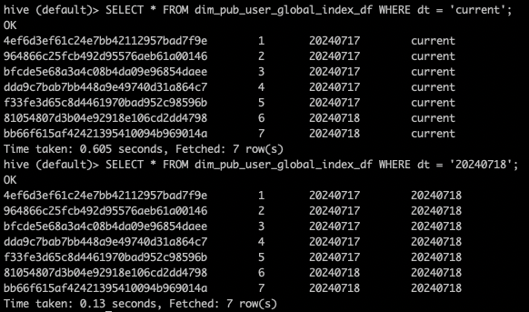

## 1. 为什么需要全局字典

当业务标签越来越多时，[宽表标签计算的方案](https://smartsi.blog.csdn.net/article/details/140087260)将不再适合，因为当列越多时，更新效率将会越慢。一种优化方案是通过对标签表构建索引，将用户ID编码后以 Bitmap 格式保存(一般使用 [RoaringBitmap](https://smartsi.blog.csdn.net/article/details/127833352) 进行压缩存储)，将关系运算转化 Bitmap 的交并差运算，进而加速实时计算性能。然后用户ID可能是字符类型的，由于 Bitmap 只能保存整数信息，因此需要先将用户ID进行整数编码。对用户ID进行编码不仅可以方便存储进 Bitmap，还可以使ID信息保持连续性。在这将用户ID进行整数编码的过程就是构建全局字典的过程。

那全局字典是什么呢？全局字典其实就是一个比较大的 Map。Map 的 KEY 保存了用户ID原始字符类型的值，而 VALUE 保存了对用户ID进行整数编码后的整型值。有了全局字典之后就可以实现对原始字符类型值的转化，再把转化后的整型值存入 Bitmap。

## 2. 构建全局字典

业界主要有两种构建全局字典的方法：第一个是基于 Trie 树的全局字典，第二种是基于 row_number 的全局字典。今天我们主要讲的就是基于 row_number 的全局字典。假设我们有一个每日活跃用户表 `dim_pub_user_di`：
```sql
CREATE TABLE IF NOT EXISTS dim_pub_user_di (
  user_id String COMMENT '用户ID'
)
PARTITIONED BY(
  dt String COMMENT '日期'
)
ROW FORMAT DELIMITED
FIELDS TERMINATED BY '\t'
LINES TERMINATED BY '\n';

INSERT INTO dim_pub_user_di PARTITION (dt = '20240717')
VALUES
  ('964866c25fcb492d95576aeb61a00146')
  ,('dda9c7bab7bb448a9e49740d31a864c7')
  ,('4ef6d3ef61c24e7bb42112957bad7f9e')
  ,('f33fe3d65c8d4461970bad952c98596b')
  ,('bfcde5e68a3a4c08b4da09e96854daee');

INSERT INTO dim_pub_user_di PARTITION (dt = '20240718')
VALUES
  ('bb66f615af42421395410094b969014a')
  ,('81054807d3b04e92918e106cd2dd4798')
  ,('4ef6d3ef61c24e7bb42112957bad7f9e');
```
将用户ID进行整数编码存储的全局字典表为 `dim_pub_user_global_index_df`：
```sql
CREATE TABLE IF NOT EXISTS dim_pub_user_global_index_df (
  user_id String COMMENT '用户ID',
  user_index BIGINT COMMENT '用户全局整数编码',
  gmt_create String COMMENT '编码生成日期'
)
PARTITIONED BY(
  dt String COMMENT '日期'
)
ROW FORMAT DELIMITED
FIELDS TERMINATED BY '\t'
LINES TERMINATED BY '\n';
```
`user_index` 为用户ID进行整数编码之后的全局编码。

### 2.1 全量用户去重

第一步是对用户每日活跃表 `dim_pub_user_di` 去重，保存每次输入的值不重复：
```sql
WITH user_di AS (
    -- 每日活跃用户
    SELECT user_id, '${date}' AS gmt_create
    FROM dim_pub_user_di
    WHERE dt = '${date}' AND COALESCE(user_id, '') != ''
    GROUP BY user_id
)
```

### 2.2 获取全局字典表

首先获取将用户ID进行整数编码存储的全局字典表：
```sql
WITH global_index AS (
    -- 存量用户编码
    SELECT user_id, user_index, gmt_create
    FROM dim_pub_user_global_index_df
    WHERE dt = 'current'
)
```
在这全局字典表使用分区表的原因是想保留每次迭代的版本，有问题便于回滚。使用 current 分区的目的是保证每次获取的字典表都是最新最全的字典表，同时防止重刷带来混乱问题。

### 2.3 新增用户编码

有了全局字典表和去重后的全量用户表之后可以计算新增用户的全局编码。使用每日活跃用户的去重值关联全局字典表，通过 WHERE 条件可以把未编码的新增用户抽出来，我们只需要对未编码的新增用户做编码即可，在这使用 ROW_NUMBER 函数对未编码的新增用户做整数编码：
```sql
WITH new_user_index AS (
    -- 新增用户编码
    SELECT a1.user_id, a1.gmt_create, ROW_NUMBER() OVER(ORDER BY a1.user_id ASC) AS index
    FROM user_di AS a1
    LEFT OUTER JOIN global_index AS a2
    ON a1.user_id = a2.user_id
    WHERE a2.user_id IS NULL
)
```
第一次执行时全局字典表没有数据，随着后续每次迭代会把新增用户补全进来。第一次执行时相当于把目前全量活跃用户都当做是新增用户进行编码。

### 2.4 新增用户全局编码

由于上一步骤中使用 ROW_NUMBER 函数对未编码的新增用户做整数编码只是实现了局部编码，并未实现全局上的编码。需要在全局字典表编码基础之上继续编码，因此需要拿到全局字典最大编码再加上当前局部编码即为新增用户的全局编码：
```sql
WITH max_global_index AS (
    -- 全局字典最大编码
    SELECT 'key' AS join_key, MAX(user_index) AS max_user_index
    FROM global_index
),
new_user_index AS (
    -- 新增用户编码
    SELECT 'key' AS join_key, a1.user_id, a1.gmt_create, ROW_NUMBER() OVER(ORDER BY a1.user_id ASC) AS index
    FROM user_di AS a1
    LEFT OUTER JOIN global_index AS a2
    ON a1.user_id = a2.user_id
    WHERE a2.user_id IS NULL
),
new_user_global_index AS (
    -- 新增用户全局编码
    SELECT
        a1.user_id, a1.gmt_create, index + COALESCE(max_user_index, 0) AS user_index
    FROM new_user_index AS a1
    LEFT OUTER JOIN max_global_index AS a2
    ON a1.join_key = a2.join_key
)
```

### 2.5 更新全局字典表

将新增用户的全局编码和全局字典表做一个 UNION，即将增量值和历史值合在一起为最新的全局字典：
```sql
INSERT OVERWRITE TABLE dim_pub_user_global_index_df PARTITION (dt='${date}')
-- 存量用户全局索引
SELECT user_id, user_index, gmt_create
FROM global_index
UNION ALL
-- 新增用户全局索引
SELECT user_id, user_index, gmt_create
FROM new_user_index
```
### 2.4 完整示例

整体流程合并之后完整代码如下所示：
```sql
WITH user_di AS (
    -- 每日活跃用户
    SELECT 'key' AS join_key, user_id, '${date}' AS gmt_create
    FROM dim_pub_user_di
    WHERE dt = '${date}' AND COALESCE(user_id, '') != ''
    GROUP BY user_id
),
global_index AS (
    -- 存量用户编码
    SELECT user_id, user_index, gmt_create
    FROM dim_pub_user_global_index_df
    WHERE dt = 'current'
),
max_global_index AS (
    -- 存量用户最大编码
    SELECT 'key' AS join_key, MAX(user_index) AS max_user_index
    FROM global_index
),
new_user_index AS (
    -- 新增用户编码
    SELECT
        a1.user_id, a1.gmt_create
        ,ROW_NUMBER() OVER(ORDER BY a1.user_id ASC) + COALESCE(max_user_index, 0) AS user_index
    FROM user_di AS a1
    LEFT OUTER JOIN global_index AS a2
    ON a1.user_id = a2.user_id
    LEFT OUTER JOIN max_global_index AS a3
    ON a1.join_key = a3.join_key
    WHERE a2.user_id IS NULL
),
new_global_index AS (
  -- 存量用户全局索引
  SELECT user_id, user_index, gmt_create
  FROM global_index
  UNION ALL
  -- 新增用户全局索引
  SELECT user_id, user_index, gmt_create
  FROM new_user_index
)
FROM new_global_index
INSERT OVERWRITE TABLE dim_pub_user_global_index_df PARTITION (dt='${date}')
SELECT user_id, user_index, gmt_create
INSERT OVERWRITE TABLE dim_pub_user_global_index_df PARTITION (dt='current')
SELECT user_id, user_index, gmt_create;
```

## 3. 示例

按照上述代码计算 20240717 号全局字典，效果如下：



可以看到 20240717 号的5名用户编码从1开始编码到5。在 20240717 又有三名用户活跃，其中有两名用户是第一次活跃，因此会为这两名用户新生成全局编码：



> 新增的两名用户为 'bb66f615af42421395410094b969014a' 和 '81054807d3b04e92918e106cd2dd4798'
