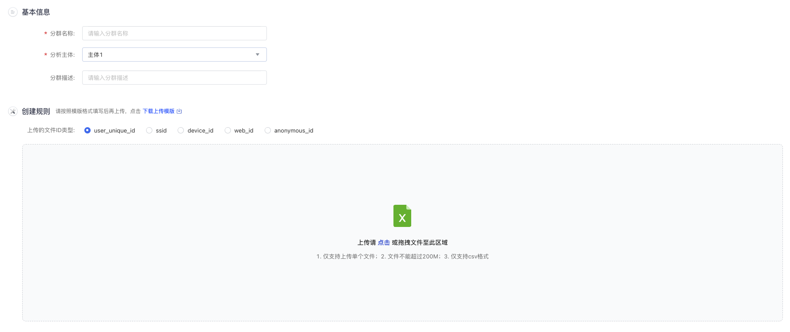

开发群组洞察功能：
- 未实现功能点击均提示功能开发中
- 点击群组细查跳转群组列表页，列表页展示，参考第一张UI图：
  - 展示群组名称(group_name)、群组状态(group_status)、创建方式(group_type)、实体类型(entity_identifier_Id)、群组规模(group_count)、创建人(creator)、创建时间(gmt_create)、更新时间(instance_end_time)、执行状态(instance_status)、操作(展示查看、编辑、分析，其他点击...按钮，包含推送、重新执行、下载、复制、删除)
- 点击群组筛选与点击列表页上的新建群组按钮功能一样，均弹出页面让用户选择群组创建方式
  - 目前支持3种方式：规则创建、上传文件创建、SQL创建。
  - 第一期先实现规则创建创建，如下所示。

## 创建方式1：规则创建

即通过事件筛选、属性筛选等条件创建群组，支持选择‘每日例行’或‘手动更新’。
- 基本信息
  - 群组名称：自定义群组名称。
  - 群组描述
  - 计算周期
    - 周期调度：用户分群创建完成后将在每天定期进行计算。选择每日例行时，您还需在下方配置计算时间。
      - 调度周期：目前只支持日调度周期，下拉选择只有日
      - 计算时间：调度周期为日时，格式为 00:00 时分，点击可以选择具体的时分。
      - Cron 表达式：选择调度时间后自动显示调度时间对应的 Cron 表达式，不可编辑。
      - 生效日期: 有永久生效和指定日期两种方式，默认选中永久生效单选按钮；选中指定时间时可以设置计算的时间区间。
    - 手动更新：用户分群创建完成后将进行计算，计算完成后不会自动更新。若需要重新计算，需手动点击‘更新’。
  - 实体标识：
- 群组规则，严格按照第二张UI图开发
  - 灵活组合使用以下规则来筛选当前创建的分群中的用户：“<实体名称>做过”、“<实体名称>没做过”、“<实体名称>依次做过”、“<实体名称>是”、“<实体名称>不是”
    - 只有用户实体：“<实体名称>做过”、“<实体名称>没做过”、“<实体名称>依次做过”
  - 每个规则均支持增加对应规则的过滤条件，且多个过滤条件间的逻辑关系支持“AND/OR”切换
  - 组合使用多个规则时，最多支持两层规则套用，且外层规则与内层规则支持修改规则间的逻辑关系，支持“AND/OR”切换。

详细参考文档：https://www.volcengine.com/docs/84129/1261555?lang=zh#579b6f4b


点击添加规则按钮，可以选择需要添加的规则类型。支持的规则类型包括标签、群组、事件和行为序列：
- 标签
  - 后面紧跟标签下拉框，根据选择的实体标识请求 /label/list 接口获取所有实体标识下的标签
  - 后面紧跟标签操作符下拉框，根据选择的标签数据类型(label_data_type)获取支持的操作符。
  - 后面紧跟标签值输入框。
- 群组
  - 后面紧跟群组操作符下拉框，支持包含和不包含两种操作符。
  - 后面紧跟群组下拉框，根据选择的实体标识请求 /group/list 接口获取所有实体标识下的群组
- 事件：只有实体为用户才支持事件规则
  - 后面紧跟时间框，默认是昨天，点击是时间框，可以自由选择时间(单点或者区间)
  - 后面紧跟事件操作符下拉框，支持做过和为做过操作符。
  - 后面紧跟事件下拉框。请求 /event/list 接口获取所有事件
  - 后面紧跟指标下拉框，支持总次数、总人数两种操作符。
  - 后面紧跟指标运算符下拉框，支持总次数、总人数两种操作符。
  - 后面紧跟指标值输入框。
- 行为序列
  - 后面紧跟时间框，默认是昨天，点击是时间框，可以自由选择时间(单点或者区间)。后面文案是 `依次发生过`
  - 下方可以添加多个不同的事件下拉框。请求 /event/list 接口获取所有事件。


逻辑关系：
- 规则组内逻辑
  - 整个规则组内的多个规则共享一个"且/或"操作符
  - 显示在左侧垂直线条中间
  - 当规则组内规则数量>1时才显示
- 规则组间逻辑
  - 规则组之间使用"且/或"操作符连接
  - 显示在两个规则组之间的居中位置


标签操作符只根据标签数据类型(label_data_type)决定操作符类型：
- 文本型：正则匹配、等于、不等于、包含、不包含、为空、不为空
- 数值型：等于、不等于、大于、大于等于、小于、小于等于、范围
- 时间型：范围、等于、不等于、大于、大于等于、小于、小于等于


计算周期中的每日例行，修改为周期调度：
- 周期调度：选择周期调度时，您还需在下方配置如下几个配置
  - 调度周期：目前只支持日调度周期，下拉选择只有日
  - 计算时间：调度周期为日时，格式为 00:00 时分，点击可以选择具体的时分。
  - Cron 表达式：选择调度时间后自动显示调度时间对应的 Cron 表达式，不可编辑。
  - 生效日期: 有永久生效和指定日期两种方式，默认选中永久生效单选按钮；选中指定时间时可以设置计算的时间区间。


```sql
DROP Table `profile_meta_group`;
CREATE TABLE IF NOT EXISTS `profile_meta_group`(
    `id` BIGINT UNSIGNED AUTO_INCREMENT COMMENT '自增ID',
    `group_id` VARCHAR(40) NOT NULL COMMENT '群组ID',
    `group_status` INT NOT NULL COMMENT '群组状态: 1-启用,2-停用',
    `group_name` VARCHAR(100) NOT NULL COMMENT '群组名称',
    `group_type` INT NOT NULL COMMENT '群组类型: 1-标签筛选,2-群组交并,3-行为圈选,4-行为序列圈选,5-组合人群,6-文件上传',
    `group_desc` VARCHAR(200) COMMENT '群组描述',
    `group_rule` VARCHAR(500) NOT NULL COMMENT '群组规则',
    `group_count` INT NOT NULL COMMENT '群组覆盖规模',
    `entity_id` VARCHAR(50) NOT NULL COMMENT '群组主体ID',
    `source_type` INT NOT NULL DEFAULT 1 COMMENT '创建方式: 1-系统内置,2-自定义',
    `instance_id` INT COMMENT '最新执行任务实例ID',
    `instance_status` INT COMMENT '最新执行状态: 1-未运行,2-运行中,3-运行成功,4-运行失败',
    `instance_start_time` DATETIME COMMENT '最新执行开始时间',
    `instance_end_time` DATETIME COMMENT '最新执行结束时间',
    `instance_msg` VARCHAR(500) COMMENT '最新执行信息，只有运行失败时才有',
    `owner` VARCHAR(100) NOT NULL COMMENT '群组负责人',
    `creator` VARCHAR(100) NOT NULL COMMENT '创建者',
    `modifier` VARCHAR(100) NOT NULL COMMENT '修改者',
    `gmt_create` DATETIME NOT NULL DEFAULT CURRENT_TIMESTAMP COMMENT '创建时间',
    `gmt_modified` DATETIME NOT NULL DEFAULT CURRENT_TIMESTAMP ON UPDATE CURRENT_TIMESTAMP COMMENT '修改时间',
    PRIMARY KEY (`id`),
    UNIQUE (`group_id`)
)ENGINE=InnoDB DEFAULT CHARSET=utf8mb4 COMMENT '画像-群组';
```


## 1. 创建群组

### 1.1 文件上传


通过上传 id 列表文件的方式创建用户分群，当项目有多个用户口径id时，您可以自选其中1个id上传，请注意保持上传的文档id类型与页面选择的一致。




先将文件上传保存到OSS，文件上传成功之后提示：文件上传成功，请先保存分群，在分群列表中查看计算结果。

第一次保存时会将文件中的用户保存到群组对应的表中。

状态：计算中

文件上传创建群组的 group_rule：
- uuid_file_key：远程存储的地址
- file_name：原始上传文件名称

```json
{
    "uuid_file_key": "upload_uuid/2428400/20251130/fd5cd375-c5d6-4268-af8b-cf628107f201.csv",
    "file_list": [
        {
            "name": "user_unique_id_template.csv"
        }
    ]
}
```


```

```
