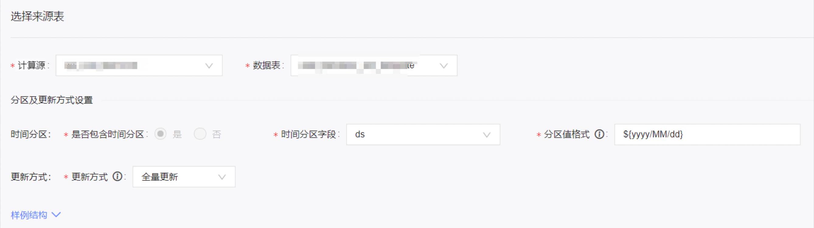
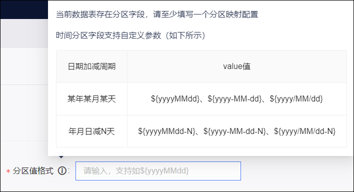
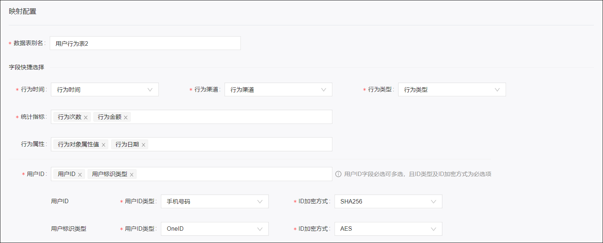
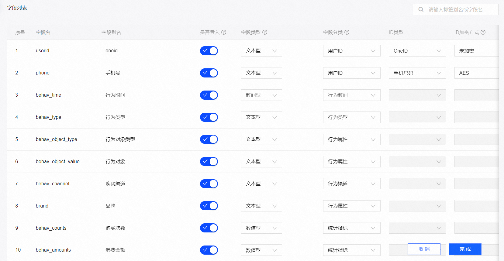

## 1. 数据集设计

```sql
-- 3. 数据集
-- 3. 数据集
DROP Table `profile_meta_dataset`;
CREATE TABLE IF NOT EXISTS `profile_meta_dataset`(
    `id` BIGINT UNSIGNED AUTO_INCREMENT COMMENT '自增ID',
    `status` INT NOT NULL DEFAULT 1 COMMENT '状态:1-启用,2-停用',
    `dataset_id` VARCHAR(40) NOT NULL COMMENT '数据集ID',
    `dataset_name` VARCHAR(100) NOT NULL COMMENT '数据集名称',
    `dataset_type` INT NOT NULL DEFAULT 1 COMMENT '数据集类型: 1-标签数据集,2-行为数据集,3-统计数据集',
    `dataset_desc` VARCHAR(200) COMMENT '数据集描述',
    `source_type` INT NOT NULL DEFAULT 1 COMMENT '创建方式: 1-系统内置,2-自定义',
    `datasource_id` VARCHAR(50) NOT NULL COMMENT '同步的数据源ID',
    `table_name` VARCHAR(50) NOT NULL COMMENT '原始数据表名',
    `partition_field` VARCHAR(50) COMMENT '同步的数据表的时间分区字段',
    `partition_format` VARCHAR(50) COMMENT '同步的数据表分区值格式',
    `entity_id` VARCHAR(50) NOT NULL COMMENT '主体(实体)ID',
    `entity_field` VARCHAR(100) NOT NULL COMMENT '主体(实体)标识字段',
    `fields` VARCHAR(500) NOT NULL COMMENT '数据集字段',
    `instance_id` INT COMMENT '最新执行任务实例ID',
    `instance_status` INT COMMENT '最新执行状态: 1-未运行,2-运行中,3-运行成功,4-运行失败',
    `instance_start_time` DATETIME COMMENT '最新执行开始时间',
    `instance_end_time` DATETIME COMMENT '最新执行结束时间',
    `instance_msg` VARCHAR(500) COMMENT '最新执行信息，只有运行失败时才有',
    `owner` VARCHAR(100) NOT NULL COMMENT '负责人',
    `creator` VARCHAR(100) NOT NULL COMMENT '创建者',
    `modifier` VARCHAR(100) NOT NULL COMMENT '修改者',
    `gmt_create` DATETIME NOT NULL DEFAULT CURRENT_TIMESTAMP COMMENT '创建时间',
    `gmt_modified` DATETIME NOT NULL DEFAULT CURRENT_TIMESTAMP ON UPDATE CURRENT_TIMESTAMP COMMENT '修改时间',
    PRIMARY KEY (`id`),
    UNIQUE(`dataset_id`)
)ENGINE=InnoDB DEFAULT CHARSET=utf8mb4 COMMENT '画像-数据集';
```


```json
{
  "dataset_name": "核心用户行为数据集",
  "dataset_type": 2,
  "dataset_desc": "核心用户行为数据集-测试",
  "source_type": 2,
  "datasource_id": "0417202725185472",
  "table_name": "dwd_app_user_behavior_di",
  "partition_field": "dt",
  "partition_format": "yyyyMMdd",
  "entity_id": "0217207495406656",
  "entity_field": "uid",
  "fields":[
    {
        "status": 1,
        "name": "uid",
        "alias": "用户ID",
        "category": 1,
        "organize_type": 1,
        "data_type": 1,
        "dist_type": 2
    },
    {
      "status": 1,
      "name": "event_type",
      "alias": "行为类型",
      "category": 3,
      "organize_type": 1,
      "data_type": 1,
      "dist_type": 1
    },
    {
      "status": 1,
      "name": "event_ts",
      "alias": "行为时间",
      "category": 4,
      "organize_type": 1,
      "data_type": 3,
      "dist_type": 2
    },
    {
      "status": 1,
      "name": "os",
      "alias": "操作系统",
      "category": 4,
      "organize_type": 1,
      "data_type": 3,
      "dist_type": 2
    },
    {
      "status": 1,
      "name": "event_args",
      "alias": "事件扩展参数",
      "category": 7,
      "organize_type": 5,
      "data_type": 1,
      "dist_type": 2
    },
    {
      "status": 1,
      "name": "biz_args",
      "alias": "业务扩展参数",
      "category": 7,
      "organize_type": 6,
      "data_type": 1,
      "dist_type": 2
    }
  ]
}

```

## 2. 数据集管理

### 2.1 数据集创建

> 导入任务

#### 2.1.1 公共

步骤：
- 选择要导入的数据源。
- 根据数据源下拉获取所有的数据表，选择要导入的数据表。
- 选择的是表，则系统会自动识别该表是否包含时间分区
  - 若表存在时间分区则至少填写一个分区映射配置(分区值格式)
  - 若表不存在时间分区，则无需选择
- 填写数据集名称
- 填写实体标识字段：实体标识类型(实体ID)以及实体标识(实体ID对应的数据表字段)
  - 实体标识是实体在该表中的唯一标识，可以唯一识别一个实体，表中不能有两行数据的实体标识一样

- 导入成功之后创建一个表名为数据集ID的 ClickHouse 表来存储导入的数据。


#### 2.1.2 标签数据集

```sql
DROP Table `user_profile`;
CREATE TABLE `user_profile` (
    `id` bigint unsigned NOT NULL AUTO_INCREMENT COMMENT '自增ID',
    `uid` varchar(40) NOT NULL COMMENT '用户ID',
    `age` INT NOT NULL COMMENT '年龄',
    `sex` varchar(100) NOT NULL COMMENT '性别',
    `prov` varchar(100) NOT NULL COMMENT '常驻省份',
    `gmt_create` datetime NOT NULL DEFAULT CURRENT_TIMESTAMP COMMENT '创建时间',
    `gmt_modified` datetime NOT NULL DEFAULT CURRENT_TIMESTAMP ON UPDATE CURRENT_TIMESTAMP COMMENT '修改时间',
    PRIMARY KEY (`id`),
    UNIQUE(`uid`)
) ENGINE=InnoDB DEFAULT CHARSET=utf8mb4 COMMENT='用户基础画像';


DROP Table `test`;
CREATE TABLE `test` (
    `id` bigint unsigned NOT NULL AUTO_INCREMENT COMMENT '自增ID',
    `uid` varchar(40) NOT NULL COMMENT '用户ID',
    `gmt_create` datetime NOT NULL DEFAULT CURRENT_TIMESTAMP COMMENT '创建时间',
    `gmt_modified` datetime NOT NULL DEFAULT CURRENT_TIMESTAMP ON UPDATE CURRENT_TIMESTAMP COMMENT '修改时间',
    PRIMARY KEY (`id`),
    UNIQUE(`uid`)
) ENGINE=InnoDB DEFAULT CHARSET=utf8mb4 COMMENT='测试';
```


#### 2.1.3 行为数据集

行为数据集记录实体(一般是指用户)的浏览、加购、收藏、购买等行为。基于用户行为数据，可以进行人群筛选，还可以生成偏好类标签等自定义标签。

为了创建行为数据集，需要将数据源中的表导入行为数据集对应的底层表中。导入的行为数据表需要满足一定的数据要求，必须具有如下几类字段：
- 实体ID
- 行为时间：时间型，行为发生的时间戳，必选字段。
- 行为类型：可以是登录、浏览、加购、收藏等。必选字段，每类一个。
- 行为属性：如操作系统、地域等。可选字段，可以设置多个。
- 行为指标：比如数量、金额等。是可选字段，可以设置多个。
- 自定义：支持字符串 JSON 和 MAP 两种类型，用户可以通过自定义属性创建属性。

> 所有字段的字段名均可自定义；支持分区表;表中无主键，相同的用户ID可以有多条记录;

> 支持 String、BIGINT、DOUBLE、MAP等类型

字段类型：
- 文本型
- 数值型
- 时间型
- JSON型
- MAP型

> 非自定义类型字段只支持文本型、数值型以及时间型，会自动转为数据集公共属性。自定义类型字段只支持JSON和MAP型，需要用户手动提取来创建事件属性。

假设有如下 Hive 表，需要导入生成一个行为数据集：
```sql
CREATE TABLE IF NOT EXISTS dwd_app_user_behavior_di (
  uid String COMMENT '用户ID',
  event_type String COMMENT '行为类型：click、page_view、play等',
  event_ts BIGINT COMMENT '行为发生事件时间',
  os String COMMENT '操作系统',
  os_version String COMMENT '操作系统版本',
  app_version String COMMENT 'App版本',
  brand String COMMENT '品牌',
  access String COMMENT '网络类型',
  gps_prov String COMMENT 'GPS地域-省',
  event_args String COMMENT '事件扩展参数',
  biz_args String COMMENT '业务扩展参数',
  ext MAP<STRING,STRING> '扩展参数'
)
PARTITIONED BY(
  dt string
)
ROW FORMAT DELIMITED
FIELDS TERMINATED BY '\t'
LINES TERMINATED BY '\n';
```

| 字段名 | 字段别名 | 是否导入 | 字段类型 | 字段分类 |
| :------------- | :------------- | :------------- | :------------- | :------------- |
| uid | 用户ID | 是 | 文本型 | 实体ID |
| event_type | 行为类型 | 是 | 文本型 | 行为类型 |
| event_ts | 行为时间 | 是 | 时间型 | 行为时间 |
| os | 操作系统 | 是 | 文本型 | 行为属性 |
| os_version | 操作系统版本 | 是 | 文本型 | 行为属性 |
| app_version | App版本 | 是 | 文本型 | 行为属性 |
| brand | 品牌 | 是 | 文本型 | 行为属性 |
| access | 网络类型 | 是 | 文本型 | 行为属性 |
| gps_prov | GPS省份 | 是 | 文本型 | 行为属性 |
| event_args | 事件扩展参数 | 是 | JSON型 | 自定义 |
| biz_args | 业务扩展参数 | 是 | JSON型 | 自定义 |
| ext | 扩展参数 | 是 | MAP型 | 自定义 |

```json
[
  {
      "name": "uid",
      "alias": "用户ID",
      "type": 1,
      "category": 1,
      "status": 1
  },
  {
      "name": "event_type",
      "alias": "行为类型",
      "type": 1,
      "category": 2,
      "status": 1
  },
  {
      "name": "event_ts",
      "alias": "行为时间",
      "type": 3,
      "category": 3,
      "status": 1
  },
  {
      "name": "os",
      "alias": "操作系统",
      "type": 1,
      "category": 4,
      "status": 1
  },
  ...
  {
      "name": "event_args",
      "alias": "事件扩展参数",
      "type": 4,
      "category": 5,
      "status": 1
  },
  {
      "name": "biz_args",
      "alias": "业务扩展参数",
      "type": 4,
      "category": 5,
      "status": 1
  },
  {
      "name": "ext",
      "alias": "扩展参数",
      "type": 5,
      "category": 5,
      "status": 1
  }
]
```


选择要导入的数据源、数据表：



数据表可以选择表，也可以选择视图
- 若选择的是表，则系统会自动识别该表是否包含时间分区。
  - 若表包含时间分区，请选择时间分区字段，并输入分区值的格式，支持的格式如下图所示
  
  - 并且，请选择希望的更新方式：
    - 增量更新：每次更新前保存历史数据，把新的数据保存在新的分区。需要选择首次调度是否拉取历史数据。
    - 全量更新：每次更新前清空历史数据，不分区保存。

填写数据集名称：



在字段列表中，为不需要导入的字段关闭导入开关。关闭后，字段将无法参与任何应用，后续可在编辑时打开。



- 第一次时主动拉取数据表下的全部字段，用户可以选择需要导入的字段。
- 编辑时加载的是用户第一次时主动拉取的字段。
- 如果数据表添加新的字段，可以通过手动刷新的方式加载新的字段。
- 如果数据删除了字段，通过手动刷新的方式加载时会标注字段已经被删除。


为需要导入的字段设置字段别名、字段类型、字段分类

```
{
  "dataset_name": "核心用户行为数据集",
  "dataset_type": 2,
  "dataset_desc": "客户端埋点上报用户行为",
  "datasource_id": ""
}
```


....
