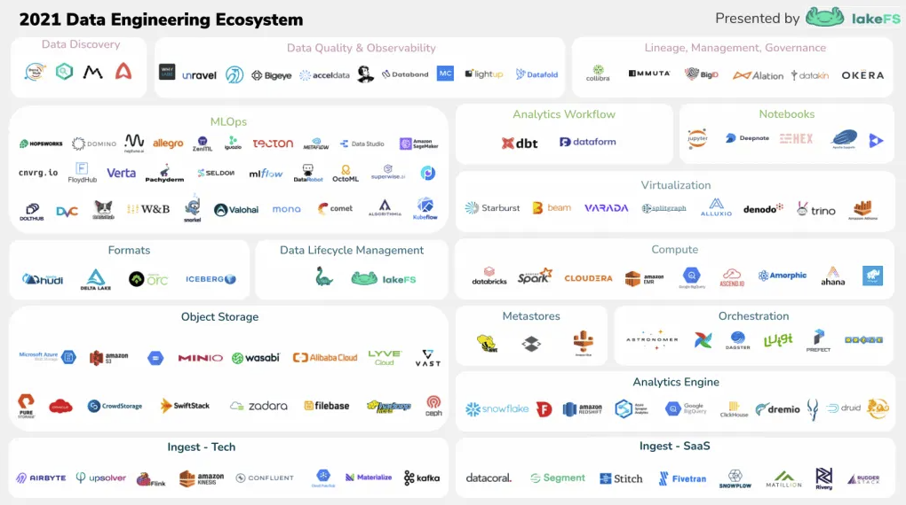

让我们从显而易见的问题开始：LakeFS 项目不是孤立存在的，它属于一个更大的数据工程技术和生态系统，与我们正在解决的[问题](https://lakefs.io/blog/why-we-built-lakefs-atomic-and-versioned-data-lake-operations/)互补。更重要的是，我认为了解 LakeFS 在生态系统重所处的位置对于确定我们可以通过解决当今实践中的痛点为用户带来额外价值至关重要。话虽如此，我很高兴与更大的社区分享我们创建和维护的东西！最后我总结了一些关于未来的想法和预测。



数据生态系统 LakeFs 所在的部分可以描述开放、灵活的分析平台，能够支持现代数据团队核心功能:
- 数据密集型应用程序和API
- 人工智能和机器学习项目
- 基于数仓的商业智能BI和报告

我们在上面图中看到的是这些平台的主要组件。下面我将更详细地介绍每一个，并从底部开始向上介绍。

## 1. 数据输入 Ingestion

第一步是将数据输入系统，有三种主要策略。

### 1.1 批量输入

第一种策略是以批处理方式上传或转储数据文件，这在大多数编程语言或者常见的数据转换库(例如，Pandas和Spark）中很容易实现。例如如下使用简单的 Python 函数实现：
```python
with open('file.csv', 'rb') as f:
    client.objects.upload_object(
        repository='example-repo',
        branch='my-branch',
        path='path/to/file.csv',
        content=f
    )
```

### 1.2 流式输入

第二种方式是流式输入（streaming ingestion），这需要更先进的技术，将高吞吐量消息传递系统与内部计算能力相结合。最流行的是开源项目 Kafka 和它的许多托管产品。与 Kafka 竞争的是公共云服务，例如 AWS Kinesis 和 Google Pub/Sub 等。最后还有其他开源选择，例如 Flink 和 Spark Streaming。

### 1.3 托管 SaaS

与自己实现从这些系统或者数据库中获取数据不同的是，越来越多的人倾向于使用托管方法，例如使用本节介绍的五种工具(segment、Stitch、Fivetran、Snowplow和matilion)中的任何一种来处理预处理的数据连接器。不要重新发明轮子，除非您的数据量增长到足够大，以至于使用第三方工具的成本非常高。

## 2. 数据湖

数据湖的确切定义可能会因为询问对象的不同而不同。当你看到它的时候，你就会知道它的定义。主要有两种架构：
- 第一种是使用单独的对象存储和分析引擎。
- 第二种是结合对象存储和分析引擎。

### 2.1 对象存储

在第一种类型的架构中，对象存储以低成本存储任何类型的数据，并具有丰富的应用程序生态系统，可以直接从中使用数据。

常见的云对象存储服务包括：AWS S3，ADLS，GCS，还有一些其他供应商，如Wasabi，Pure，MinIO 。


在第一种类型的湖架构中，对象存储以一种经济有效的方式保存任何类型的数据，并具有丰富的应用程序生态系统，可以直接从中消费数据。

示例可以包括所有主要的云对象存储服务(AWS S3、ADLS、GCS)，以及其他提供商(如Wasabi、Pure)，甚至开源项目(如MinIO)。

### 2.2 分析引擎

分析引擎为表格和关系数据集提供SQL接口。一些引擎，如Snowflake，Druid，Firebolt，Redshift将专有存储服务与分析引擎集成，创建自包含的数据湖功能。

但是，如果您的数据位于对象存储中，则使用Lakehouse，Dremio或BigQuery等仅提供计算功能的分析引擎是有意义的。

元数据管理
有数据的地方就有元数据（metadata）。元数据用于定义模式、数据类型、数据版本、与其他数据集的关系等。它有助于提高数据集的可发现性和可管理性。

LUMAscape的以下功能都利用元数据来实现这些目标。

Open Table Formats
对象存储的特征之一是选择存储数据的格式。这也是最有影响力的决策之一，因为它直接影响湖的性能和功能。

Hudi, Iceberg和Delta等开放表格式旨在满足可变性要求（想想 GDPR）并最大限度地提高最大表的性能。他们通过管理数据集上的元数据文件来实现这一点，允许在读取或写入操作期间进行快速访问和更改。

元存储
元存储在将对象存储中的文件抽象为可查询表方面发挥着重要作用。

Hadoop生态系统中最有可能幸存下来的一个组件是Hive Metastore，这是一个虚拟化层，提供对对象存储内容的表格访问。它还在管理模式，帮助发现数据湖内容以及通过分区管理提高读取性能方面发挥作用。

Hive是市场上唯一的Metastore，在所有公共云上都提供托管或兼容版本。

看看是否会出现一个新的参与者来超越Hive，就像大多数其他Hadoop时代的技术一样，这将会很有趣。

数据生命周期管理
数据要管理生命周期，就像用git来管理代码一样。生命周期管理工具允许通过CI/CD操作和隔离的数据开发环境（而不是共享存储桶）来实现这一点。

LakeFS和Nessie都通过对数据集合启用类似git的操作来解决这个问题。值得注意的是，Nessie 利用（并依赖于）由Iceberg数据格式创建的元数据，而 LakeFS则采用与格式无关的通用数据模型。

编排工具（Orchestration）
数据管道（Data pipelines）需要对任务进行编排。一个数据管道可能包括数百甚至数千个作业（通常用DAG表示），其中一个作业的输入可能取决于多个上游作业的输出。

创建和管理数据管道并不是一项简单的工作，幸运的是，Airflow，Dagster和Prefect提供了有用的抽象来简化这项工作。

计算
在处理大数据时（通常存储在数据湖），必须使用分布式计算引擎。Hadoop在2006年面世后解决了这个问题，这是一项重大改进。自那时开始，这个子领域不断进步，目前可以直接使用SQL和客户端代码进行实时计算。

分布式计算
今天的分布式计算由Spark主导，Spark作为一项开源技术，被包含在云平台的托管服务中。

虚拟化
数据虚拟化设定了宏大的目标，无论数据位于何处，它都希望通过单个端点提供对数据的访问。

Trino（原PrestoSQL）是第一个提供这种功能的开源项目。今天，所有云平台都提供了他们的Trino托管版本，并且其他虚拟化技术（如Denodo）正在进入市场。

数据科学
并非所有用户都是工程师，因此需要工具来缩小工程师和用户之间的技术鸿沟，这里我们介绍了一些可改善分析平台上BI和DS功能体验的工具。

MLOps
机器学习模型的开发和维护在过去几年中受到了很多关注。该过程包括数十种不同的工具，如MetaFlow (Netflix)，DisDat(Intuit)和KubeFlow (Google)。同样相关的还有采用开源策略的商业公司，例如Pachyderm，DVC和Clear 。

值得关注的是，点对点的解决方案能否在管理ML模型生命周期方面胜出，或者架构是否将包含多个更专业化的工具。

您可以在此处找到该领域的深入分析。

分析工作流
转换查询的组织和执行给分析师带来了挑战。因此，像dbt和dataform这样的工具大受欢迎，为运行数据密集型代码/SQL提供了相当于IDE的功能。

Jupter notebooks
Jupyter Notebook使博客中的代码教程看起来更美观，从那时起，Notebook已成为从探索性分析到训练ML模型，甚至生产环境ETL作业的首选界面。

这一领域的新产品，如Deepnote和Hex专注于在Notebook中实现团队协作。

组织元数据
第二个元数据层不描述数据本身，而是组织元数据。最后一部分的工具旨在增强数据平台在组织环境中的可用性。

在过去18个月中，大公司发布了10个新的开源项目，提供组织数据目录。这些发现工具允许用户轻松找到数据集，可视化它们之间的连接，联系创建者并了解它们是如何使用的。

随着组织规模的扩大，重要的是要轻松找到这些信息，以维持高效且一致的数据驱动文化。

许多垂直领域的企业都致力于数据审计，可再现性和监管。此类别中的工具为这些目的简化了数据管理，有时涉及每个客户的定制解决方案。

质量和可观察性
最后，质量和可观察性保证基于规则或机器学习的数据质量监控和测试。在理想的世界中，测试将覆盖所有数据源，并在数据生命周期的所有阶段实施。

错误和异常是复杂数据系统中不可规避的部分，重要的是在用户使用数据前识别它们。随着这一类别工具的成熟，我们对数据质量的期望也会随之提高。

观察和预测
既然我们已经讨论了现代分析平台的主要组件，最后我想分享一些对未来的想法。

1. 作为核心问题的可管理性
大数据的第一个问题是处理大规模数据的可行性。在解决规模问题时，人们开发了我们今天所知的技术，如Kafka，Spark，Presto，Snowflake等。

现在人们面临的问题之一是可管理性。他们不再询问是否可以处理数据集，而是询问：在开发数据密集型应用程序时，如何提高开发效率？如何利用所有数据 （可发现性） 并确保它是高质量的 （质量和可观察性）？如何确保数据的可重复性，可审计性和治理？

数据发现，质量控制和可观察性以及沿袭、管理和治理类工具获得了爆发式增长。由于人们希望对他们的数据做更多的事情—运行更多的分析，将更多的模型投入生产等——有效使用这些工具将在实现这一目标方面发挥重要作用。我希望在未来几年内看到元数据管理领域的发展。

2. 来自未来的情书
Netflix和Uber等企业最先遇到与大规模分析相关的问题。作为回应，他们分别开发了自己的内部解决方案，如Iceberg和Hudi数据格式来解决相关问题。多年后，其它组织正在迎头赶上，其中一个例子是采用现已开源的数据格式。

我们在任务编排领域看到了相同的模式，最初在AirBnb开发的Airflow现在是一个被广泛采用的开源产品，并且出现了Prefect和Dagster等竞争对手。

最后一个值得强调的领域是数据发现，似乎每个知名公司都开发了一个内部数据目录工具，现在可以作为开源或付费服务使用。例如Amundsen (Lyft)，Datahub (LinkedIn)、 Metacat (Netflix)，Databook (Uber) 和Dataportal (Airbnb)。

3. 整合方式
LUMAscape强调的一件事是数据工程生态系统的断裂性质。按理说，我们将来会看到一定程度的整合，问题是什么类型的整合？

一种选择是让点对点解决方案与封闭的Snowflake平台更加一致。另一种选择是围绕基于开放标准的生态系统进行整合，与Databricks方法保持一致。

我的看法是，如果出现统一的解决方案，它将通过允许组织挑选对他们有意义的拼图部分而形成，最终系统产生的总附加值大于单个部件。

最后要注意的是，我在MLOps领域看到了一种平行情况。争夺市场份额的是为模型管理提供封闭式点对点解决方案的产品。然而，我敢打赌，整个生态系统在不久的将来将继续支离破碎，满足当前需求的工具将继续获得成功。
