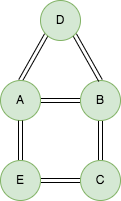

## 1. 需求

计算两个用户的共同好友个数

## 2. 数据准备

假设 friend 表有如下数据：

| user_id | friend_id |
| :------------- | :------------- |
| A | B |
| A | D |
| A | E |
| B | A |
| B | C |
| B | D |
| C | B |
| C | E |
| D | A |
| D | B |
| E | A |
| E | C |

> `<user_id, friend_id>` 表示是一对好友关系



## 3. 分析

### 3.1 共同好友


如果我们知道用户1(user_1)和用户2(user_2)的共同好友(common_friend)如下所示：

```
+---------+---------+----------------+
| user_1  | user_2  | common_friend  |
+---------+---------+----------------+
| A       | B       | D              |
| A       | C       | B              |
| A       | C       | E              |
| A       | D       | B              |
| B       | D       | A              |
| B       | E       | A              |
| B       | E       | C              |
| C       | D       | B              |
| D       | E       | A              |
+---------+---------+----------------+
```

那么计算两个用户的共同好友个数就很容易的多了。所以第一步就是计算两个用户的共同好友列表，那我们怎么样才可以得到上面的数据呢？那就是把表 friends 通过 friend_id 进行自连接：
```sql
WITH friends AS (
  SELECT 'A' AS user_id, 'B' AS friend_id
  UNION ALL
  SELECT 'A' AS user_id, 'D' AS friend_id
  UNION ALL
  SELECT 'A' AS user_id, 'E' AS friend_id
  UNION ALL
  SELECT 'B' AS user_id, 'A' AS friend_id
  UNION ALL
  SELECT 'B' AS user_id, 'C' AS friend_id
  UNION ALL
  SELECT 'B' AS user_id, 'D' AS friend_id
  UNION ALL
  SELECT 'C' AS user_id, 'B' AS friend_id
  UNION ALL
  SELECT 'C' AS user_id, 'E' AS friend_id
  UNION ALL
  SELECT 'D' AS user_id, 'A' AS friend_id
  UNION ALL
  SELECT 'D' AS user_id, 'B' AS friend_id
  UNION ALL
  SELECT 'E' AS user_id, 'A' AS friend_id
  UNION ALL
  SELECT 'E' AS user_id, 'C' AS friend_id
)
SELECT
  a.user_id AS user_1, b.user_id AS user_2, a.friend_id AS common_friend
FROM (
  SELECT user_id, friend_id
  FROM friends
) AS a
JOIN (
  SELECT user_id, friend_id
  FROM friends
) AS b
ON a.friend_id = b.friend_id;
```
输出结果如下所示：
```
+---------+---------+----------------+
| user_1  | user_2  | common_friend  |
+---------+---------+----------------+
| A       | A       | B              |
| A       | A       | D              |
| A       | A       | E              |
| B       | B       | A              |
| B       | B       | C              |
| B       | B       | D              |
| C       | C       | B              |
| C       | C       | E              |
| D       | D       | A              |
| D       | D       | B              |
| E       | E       | A              |
| E       | E       | C              |
| A       | B       | D              |
| B       | A       | D              |
| A       | C       | B              |
| C       | A       | B              |
| A       | C       | E              |
| C       | A       | E              |
| A       | D       | B              |
| D       | A       | B              |
| B       | D       | A              |
| D       | B       | A              |
| B       | E       | A              |
| E       | B       | A              |
| B       | E       | C              |
| E       | B       | C              |
| C       | D       | B              |
| D       | C       | B              |
| E       | D       | A              |
| D       | E       | A              |
+---------+---------+----------------+
```
通过上述输出结果可以发现存在两个问题：一个是自己和自己有共同好友，即 user_1 = user_2；另外一个就是存在用户1和用户2的共同好友，也存在用户2和用户1的共同好友，本质上是以一个映射关系，因此只需要保留一个即可。为了解决这两个问题，我们就需要对 user_1 和 user_2 进行限制，优化代码如下所示：
```sql
SELECT
  a.user_id AS user_1, b.user_id AS user_2, a.friend_id AS common_friend
FROM (
  SELECT user_id, friend_id
  FROM friends
) AS a
JOIN (
  SELECT user_id, friend_id
  FROM friends
) AS b
ON a.friend_id = b.friend_id
WHERE a.user_id < b.user_id;
```
输出结果如下所示：
```
+---------+---------+----------------+
| user_1  | user_2  | common_friend  |
+---------+---------+----------------+
| A       | B       | D              |
| A       | C       | B              |
| A       | C       | E              |
| A       | D       | B              |
| B       | D       | A              |
| B       | E       | A              |
| B       | E       | C              |
| C       | D       | B              |
| D       | E       | A              |
+---------+---------+----------------+
```

### 3.2 共同好友数量

有了两个用户的共同好友列表之后，计算共同好友数量就很容易的多了，只需要对用户1和用户2 进行 GROUP BY 分组求和即可：
```sql
SELECT
  user_1, user_2,
  COUNT(*) AS common_friends_num,
  CONCAT_WS(',', COLLECT_SET(common_friend)) AS common_friends
FROM (
  SELECT
    a.user_id AS user_1, b.user_id AS user_2, a.friend_id AS common_friend
  FROM (
    SELECT user_id, friend_id
    FROM friends
  ) AS a
  JOIN (
    SELECT user_id, friend_id
    FROM friends
  ) AS b
  ON a.friend_id = b.friend_id
  WHERE a.user_id < b.user_id
) AS c
GROUP BY user_1, user_2;
```
最终输出结果如下所示：
```
+---------+---------+---------------------+-----------------+
| user_1  | user_2  | common_friends_num  | common_friends  |
+---------+---------+---------------------+-----------------+
| A       | B       | 1                   | D               |
| A       | C       | 2                   | B,E             |
| A       | D       | 1                   | B               |
| B       | D       | 1                   | A               |
| B       | E       | 2                   | A,C             |
| C       | D       | 1                   | B               |
| D       | E       | 1                   | A               |
+---------+---------+---------------------+-----------------+
```


完整代码如下所示：
```sql
WITH friends AS (
  SELECT 'A' AS user_id, 'B' AS friend_id
  UNION ALL
  SELECT 'A' AS user_id, 'D' AS friend_id
  UNION ALL
  SELECT 'A' AS user_id, 'E' AS friend_id
  UNION ALL
  SELECT 'B' AS user_id, 'A' AS friend_id
  UNION ALL
  SELECT 'B' AS user_id, 'C' AS friend_id
  UNION ALL
  SELECT 'B' AS user_id, 'D' AS friend_id
  UNION ALL
  SELECT 'C' AS user_id, 'B' AS friend_id
  UNION ALL
  SELECT 'C' AS user_id, 'E' AS friend_id
  UNION ALL
  SELECT 'D' AS user_id, 'A' AS friend_id
  UNION ALL
  SELECT 'D' AS user_id, 'B' AS friend_id
  UNION ALL
  SELECT 'E' AS user_id, 'A' AS friend_id
  UNION ALL
  SELECT 'E' AS user_id, 'C' AS friend_id
)
SELECT
  user_1, user_2,
  COUNT(*) AS common_friends_num,
  CONCAT_WS(',', COLLECT_SET(common_friend)) AS common_friends
FROM (
  SELECT
    a.user_id AS user_1, b.user_id AS user_2, a.friend_id AS common_friend
  FROM (
    SELECT user_id, friend_id
    FROM friends
  ) AS a
  JOIN (
    SELECT user_id, friend_id
    FROM friends
  ) AS b
  ON a.friend_id = b.friend_id
  WHERE a.user_id < b.user_id
) AS c
GROUP BY user_1, user_2;
```
