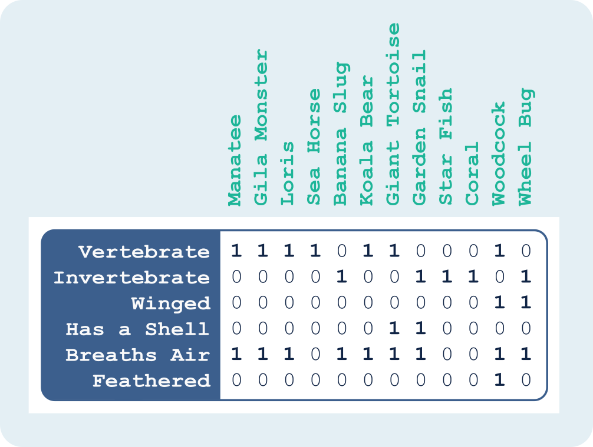
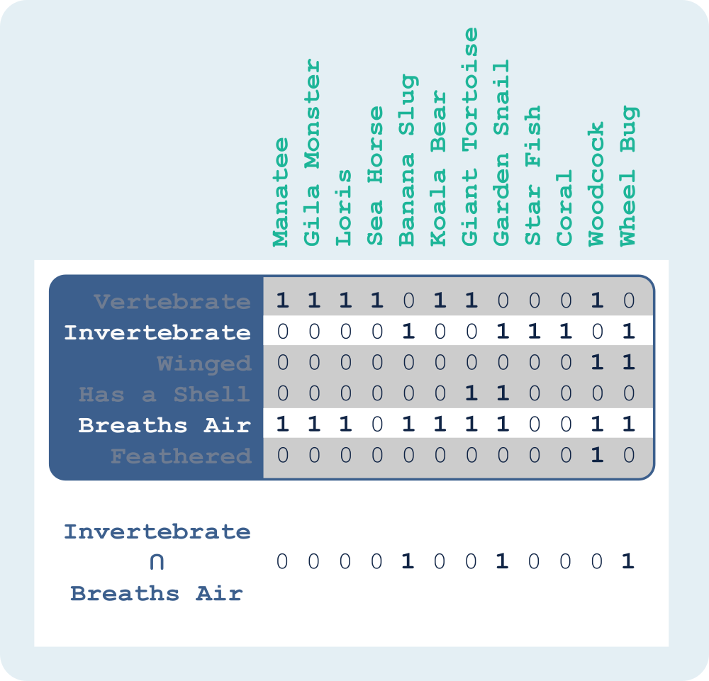
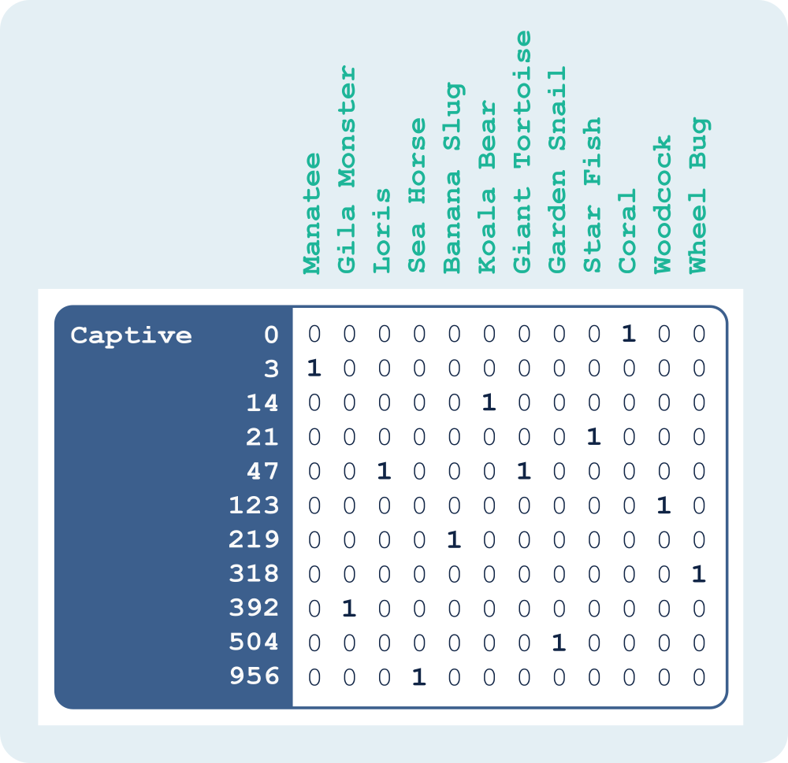
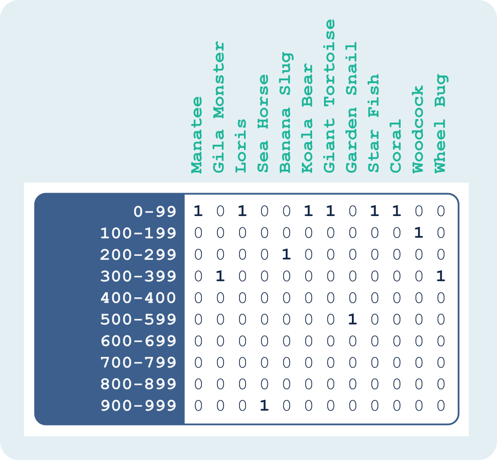
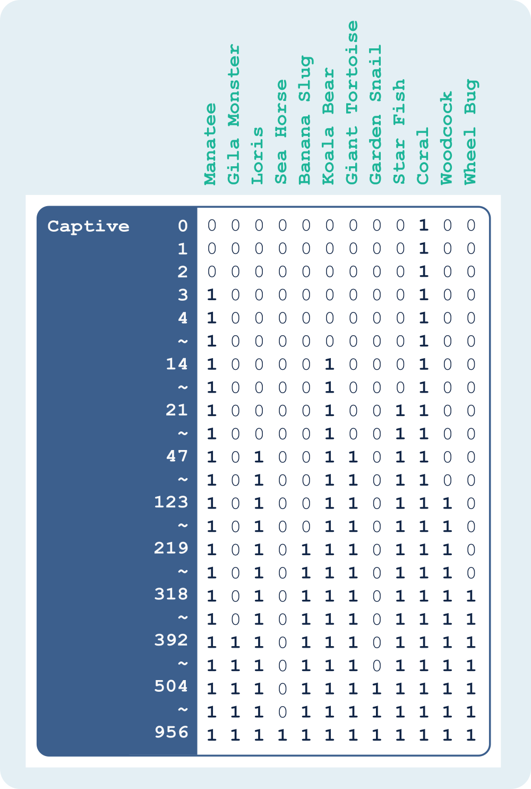
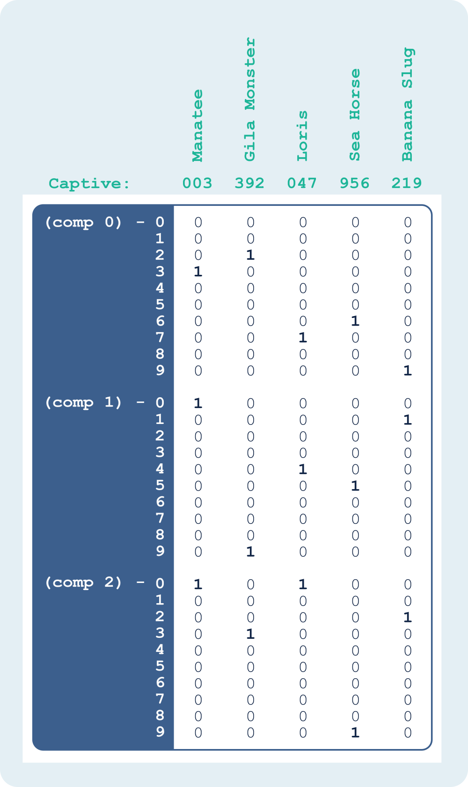
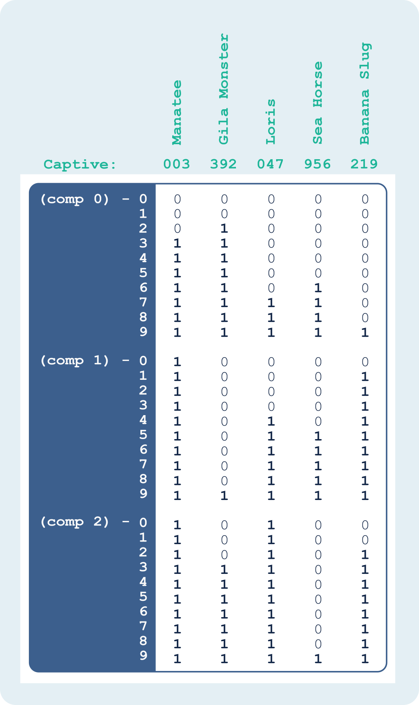
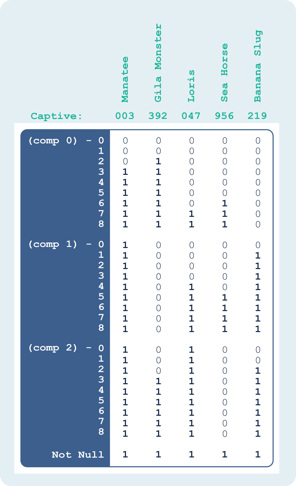
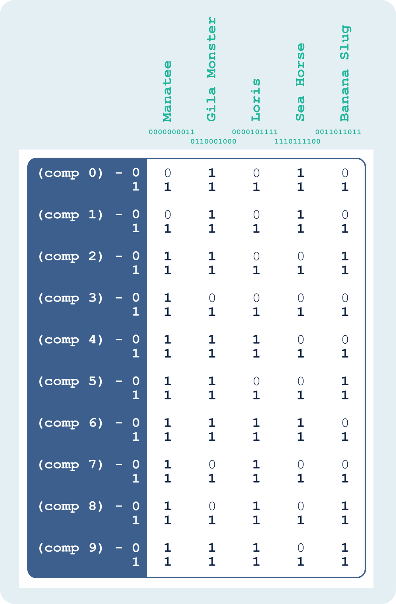
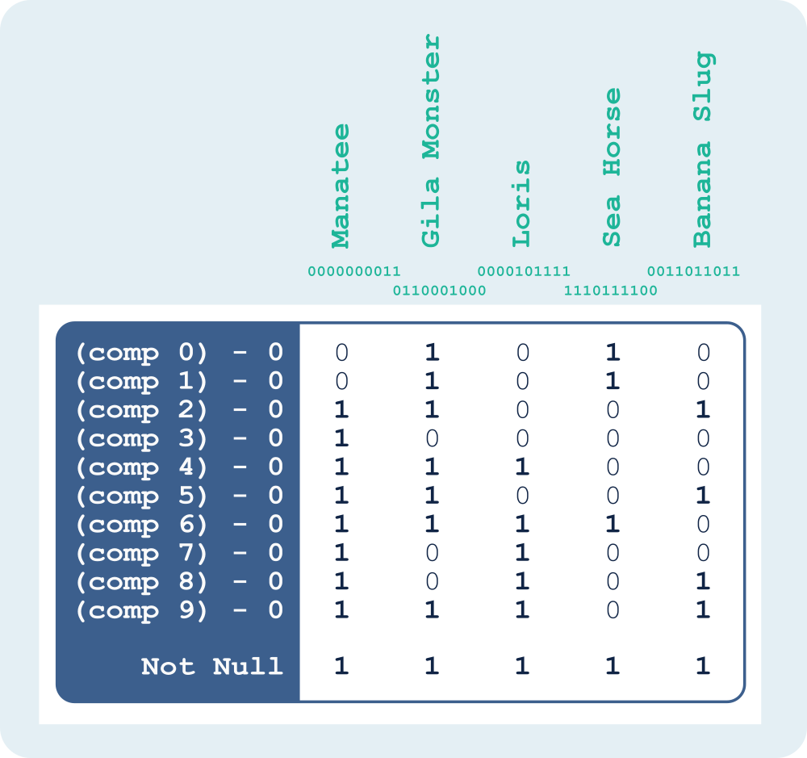

这篇文章中描述的所有概念都是基于过去几十年里一些非常聪明的人所做的研究。我只是从更高层次上描述这些事情，在阅读下面内容之前建议您先阅读更多关于 [Bit-sliced Indexes](https://cs.brown.edu/courses/cs227/archives/2008/Papers/Indexing/buchmann98.pdf)和[Range-Encoding](https://link.springer.com/chapter/10.1007/3-540-45675-9_8)的内容。

## 1. Bitmap Encoding

首先，假设我们想要对动物王国的每个动物进行分类，这样我们就可以根据它们的特征轻松有效地探索各种物种。因为我们在这讨论的是 Bitmap，所以假设示例数据集如下所示:

> 每一行表示不同的特征：脊椎动物(Vertebrate)、无脊椎动物(Invertebrate)、长翅膀(Winged)、有壳(Has A Shell)、呼吸空气(Breaths Air)、有羽毛(Feathered)

> 每一列表示不同的动物：海牛(manatee)、吉拉毒蜥(Gila Monster)、懒猴(Loris)、海马(Sea Horse)、香蕉蛞蝓(Banana Slug)、树袋熊(Koala Bear)、巨龟(Giant Tortoise)、庭园蜗牛(Garden Snail)、海星(Star Fish)、珊瑚(Coral)、丘鹬(Woodcock)、轮背猎蝽(Wheel Bug)

### 1.1 Equality-Encoded Bitmaps

上面的例子展示了一组 Equality-Encoded Bitmap，其中每一行(每个特征)都是一个 Bitmap，表示具有该特征的所有动物。Equality-Encoded 虽然看起来比较简单，但是功能非常强大。因为使用布尔关系来表示所有的东西(例如海牛有翅膀:是/否)，我们可以对数据执行各种位操作。如下图所示，我们可以通过对无脊椎动物和呼吸空气的两个 Bitmap 执行逻辑与操作来找到所有呼吸空气的无脊椎动物。根据我们的样本数据，我们可以看到香蕉蛞蝓(第5列)、庭园蜗牛(第8列)和轮背猎蝽(第12列)是呼吸空气的无脊椎动物。

用 Equality-Encoded Bitmap 可以完成我们想要的需求，但是如果布尔值不能很好地表示原始数据呢(只能表示是否)?如果我们想添加一个名为圈养(Captivity)的特征(表示当前被圈养的个数)，并且我们想要根据这些值筛选来执行查询，该怎么办呢?(我们在下面的例子中使用的圈养动物数完全是虚构的，只是有助于演示概念。)考虑到我们对 Equality-Encoded 的 Bitmap 的了解，我们可以采用几种方法来实现。

第一种方法是为每个可能的圈养数量创建一个特征(Bitmap)，如下所示:

这种方法是可行的，但是有一些局限性。首先，不是很高效。根据基数的不同，需要创建许多 Bitmap 来表示所有可能的值。其次，如果希望进行范围查询，那么必须对范围内的每个可能值执行或操作。为了知道圈养数量少于 100 的动物，查询需要执行类似于 `Captivity=99 OR Captivity=98 OR Captivity=97 OR…` 的或操作。

另一种方法是根据圈养数量进行分桶，为每个分桶创建一个 Bitmap，而不是将每个可能的值表示为一个 Bitmap，如下所示:

这种方法的好处是效率更高，也更容易查询，因为不必为了一个范围查询而对多个 Bitmap 进行合并。缺点是粒度没有那么细，会丢失一部分原始值信息，虽然能进行范围查询，但是不能进行精准查询。例如，将 47 转换为 `0-99` 分桶，将会丢失 47 这个原始值信息，不能实现精准查询圈养数量为 47 个的动物，但是可以查询圈养数量小于等于 99 个的动物。

在不同场景下，这两种方法都是完全有效的解决方案，但是第一种方案不能再基数极高的场景下使用，第二种方案不能在精确查询的场景下使用。那么在基数极高且又要精确查询的场景下，我们需要另一种方法来表示非布尔值。我们需要一种不需要编写非常多且麻烦的或操作的方式来来执行范围查询。为此，让我们讨论一下 `Range-Encoded Bitmap`，以及如何避免前面方法中遇到的一些问题。

### 1.2 Range-Encoded Bitmaps

首先，继续以上面的例子为例，看看如果使用 `Range-Encoded Bitamp` 会是什么样子：

使用 Range-Encoded Bitmap 似于使用 Equality-Encoded Bitmap，不一样的地方是我们不仅仅为对应值设置 Bit 位，我们还为每个大于该值的值设置 Bit 位。例如，因为圈养了 14 只树袋熊，所以在 Bitmap 14 中为第 6 列设置 Bit 位，同样也会在 Bitmap 15、16、17...中进行设置(大于 14 的 Bitmap)。可以看出在这 Bitmap 不再代表圈养的动物数量，而是代表圈养数量可以达到上限，即表示圈养数量小于等于该值的动物有哪些。从上图中的 Bitmap 21 可以知道海牛(manatee)、树袋熊(Koala Bear)、海星(Star Fish)、珊瑚(Coral)圈养的数量均小于等于 21。

这种编码方法让我们可以像之前一样执行范围查询，但是不用在多个不同的 Bitmap 上执行或操作，在一个或两个 Bitmap 中就可以获得我们想要的结果。例如，如果我们想知道哪些动物被圈养的数量少于 15 个，那么我们只需拉出 Bitmap 14 就可以（Bitmap 14 表示圈养数量小于等于 14 的动物有哪些，第1列的海牛、第6列的树袋熊、第10列的珊瑚）。如果我们想知道哪些动物被圈养的数量超过 21 个，这稍微有些复杂，但也不是很复杂。我们可以取出表示最大圈养数量的 Bitmap(在本例中是 Bitmap 956)，然后排除掉 Bitmap 21 中的即可。

这个方法比之前的方法简单得多，效率也高得多。现在我们已经解决了在几十个 Bitmap 上进行或操作来查询范围值的问题，并且我们也不会像在分桶方法中那样丢失任何信息。但是这种方法仍然有一些问题。首先，我们仍然需要为每个具体的圈养数量保留一个 Bitmap。最重要的是，不仅要为我们感兴趣的值设置 Bit 位，还要为每个大于该值的值设置 Bit 位，这无疑增加了复杂性和开销。这在写入密集型用例中很可能引入性能问题。

理想情况下，我们想要的是具有 Range-Encoded Bitmap 的功能和 Equality-Encoded Bitmap 的效率。接下来，我们将讨论 Bit-sliced Indexes，看看是如何帮助我们实现我们想要的结果。

## 2. Bit-sliced Indexes

如果我们想用 Range-Encoded Bitmap 来表示从 0 到 956 的每一个值，我们必须使用 957 个 Bitmap。虽然这是可行的，但它却不是最有效的方法，当值的基数变得非常高时，我们需要维护的 Bitmap 数量可能会变得令人望而却步。Bit-sliced Indexes 让我们可以以更有效的方式来表示这些相同的值。首先看一下示例数据，并讨论如何使用 Bit-sliced Indexes 来表示：

`[0, 956]` 区间内的每一个值最多有三位(个位、十位、百位)，所以我们将值分为三部分(comp 0、comp 1、comp 2)，并以 10 为基数。从图中可以看到第一列值为 003，表示海牛被圈养的数量。003 的第一部分(个位)是 3，所以我们在 comp 0 行为 3 （第4行）中设置一个 Bit 位，003 的第二部分(十位)和第三部分(百位)都是 0，所以我们在 comp 1 和 comp 2 行为 0 （第1行）中设置 Bit 位。我们以 10 为基数的索引中每个部分都需要 10 个 Bitmap 来表示所有可能的值，因此在从 0 到 956 范围值的圈养示例中，我们只需要(3 x 10) = 30 个 Bitmap(而如果我们为每个不同的值使用一个 Bitmap，则需要 957 个 Bitmap)。

我们基本上已经找到了一种更有效的方法来使用 Equality-Encoding 策略。下面让我们看看将 Bit-Slice Indexes 与 Range-Encoded 结合起来会是什么样子。

## 3. Range-Encoded Bit-Slice Indexes

### 3.1 Base-10 Components

需要注意的是，每个部分中最高有效值(以 10 为基数的情况下为 9，最后一行)始终是 1。因此，我们不需要存储最高值(最后一行)。所以对于以 10 进制、Range-Encoded、Bit-Slice 的索引，我们只需要 9 个 Bitmap 来表示一个部分。除此之外，我们还需要存储一个名为 `Not Null` 的 Bitmap，表示该列是否设置了值。下一个图展示了具体的 Bitmap：

因此，对于有 3 部分的值（三位），我们需要((3 x 9) + 1) = 28 个 Bitmap 来表示 0 到 999 范围内的任何值。现在我们有了一种非常有效存储值的方法，并且从 Range-Encoded 中得到的好处，因此我们可以执行对范围进行过滤的查询。我们可以更进一步优化，尝试对值范围以 2 进制表示进行编码。

### 3.2 Base-2 Components

如果不使用 10 进制来表示圈养值，而是改用 2 进制，那么我们最终会得到如下所示的一个 Range-Encoded、Bit-Slice 的索引:

第一列表示 2 进制值 000000011，即表示海牛被圈养了 3 头(10 进制为 3)。因为 000000011 的第一位和第二位都是 1，所以我们在 comp 0 第 1 行和 comp 1 的第 1 行中设置一个 Bit 位。由于 000000011 的其余位都是 0，所以我们在 comp 2 到 9 的第 0 行中设置一个 Bit 位，并且(因为使用 Range-Encoded)在每个大于 0 的值中设置一个 Bit 位，这意味着我们还为 comp 2 到 9 的第 1 行设置一个 Bit 位。

需要注意的是，就像我们之前看到的 10 进制下 Bitmap 9 的表示一样，二进制下的 Bitmap 1 也总是 1，所以我们不需要存储它，如下所示:

使用这种编码，我们可以用 10 个 Bitmap 来表示示例数据的范围! 另外，需要注意的是，以 2 进制、Range-Encoded、Bit-Slice 的索引是整数值二进制表示的倒数。这告诉我们，我们可以仅使用 (n + 1) 个 Bitamp 来表示基数为 n 的任何值范围(其中额外的一个 Bitmap 是 `Not Null` Bitmap)。这意味着我们可以对很大的整数值执行范围查询，而不用存储大量的 Bitmap。

> 原文:[Using Bitmaps to Perform Range Queries](https://www.featurebase.com/blog/range-encoded-bitmaps)
