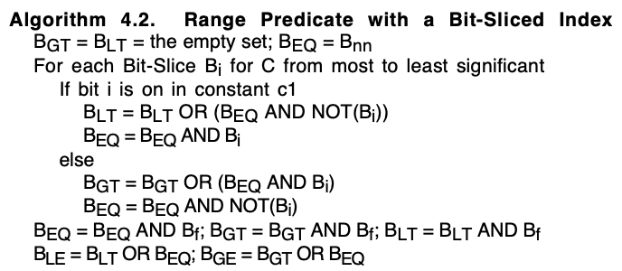

BSI(Bit Slice Index)本质上是对 KV 键值数据的压缩，将每个整数值分解为二进制表示，每个二进制位存储在一个独立的位图中。对于值 value，其二进制表示的第 i 位为 1 时，在 slices[i] 位图中记录对应的 key。下面以用户(key)与用户获取的积分(value)为例为你介绍 BSI 的原理与结构。

| user_id(用户) | score(积分十进制) | score(积分二进制) |
| :------------- | :------------- | :------------- |
| 1 | 48 | 0110000 |
| 2 | 80 | 1010000 |
| 3 | 75 | 1001011 |
| 4 | 19 | 0010011 |
| 5 | 1 | 0000001 |
| 6 | 57 | 0111001 |
| 7 | 63 | 0111111 |
| 8 | 22 | 0010110 |
| 9 | 96 | 1100000 |
| 10 | 34 | 0100010 |

表中包含用户ID user_id 列和积分 score 列。其中，score 的最大值为 96，即二进制最大位数为 7 位，因此将所有 score 的二进制值补充为 7 位。然后对二进制数据从低位向高位遍历，将位值为 1 的 user_id 存入切片 RoaringBitmap 数组的 slices 中，形成位切片索引 BSI(Bit Slice Index)。我们以用户ID为 1 的用户为例介绍，用户对应的积分 48(二进制 110000)：
- slices[0] 不添加 key=1（第0位为0）
- slices[1] 不添加 key=1（第1位为0）
- slices[2] 不添加 key=1（第2位为0）
- slices[3] 不添加 key=1（第3位为0）
- slices[4] 添加 key=1（第4位为1）
- slices[5] 添加 key=1（第5位为1）
- slices[6] 不添加 key=1（第6位为0）

上表数据最终建立了如下切片索引：

| 切片 | 用户 RoaringBitmap |
| :------------- | :------------- |
| slices[0] | {3,4,5,6,7} |
| slices[1] | {3,4,7,8,10} |
| slices[2] | {7,8} |
| slices[3] | {3,6,7} |
| slices[4] | {1,2,4,6,7,8} |
| slices[5] | {1,6,7,9,10} |
| slices[6] | {2,3,9} |

> 每个切片对应一个 RoaringBitmap，RoaringBitmap 中存储 user_id

此外，ebm 记录所有存在的用户 `{1,2,3,4,5,6,7,8,9}`，用于快速判断某个用户是否存在；maxValue 存储最大值 96，minValue 存储最小值 1。


## 1. 构造


## 2. 范围查询

范围查询是根据指定的 Value 查询对应的所有 Key，算法如下所示：



上述算法实现如下所示：
```java
RoaringBitmap GT = new RoaringBitmap();
RoaringBitmap LT = new RoaringBitmap();
RoaringBitmap EQ = this.ebm; // 不需要 this.ebm.clone()
// 从高位到低位开始遍历
for (int i = this.sliceSize - 1; i >= 0; i--) {
    // 第 i 位的值 1或者0
    int bit = (value >> i) & 1;
    if (bit == 1) {
        LT = RoaringBitmap.or(LT, RoaringBitmap.andNot(EQ, this.slices[i]));
        EQ = RoaringBitmap.and(EQ, this.slices[i]);
    } else {
        GT = RoaringBitmap.or(GT, RoaringBitmap.and(EQ, this.slices[i]));
        EQ = RoaringBitmap.andNot(EQ, this.slices[i]);
    }
}
```
- 第一步：初始化
  - EQ 初始化为全集 ebm 作为候选集合
  - GT 和 LT 初始化为空集合
- 第二步：从高位到低位迭代比较 EQ 候选集合中的值和查询值 Value 的 Bit 位大小
  - 比较策略：
    - 如果目标值 Bit 为 1，而 EQ 候选值 Bit 为 0，则说明该候选值小于目标值，则从 EQ 集合中转移到 LT 集合中
    - 如果目标值 Bit 为 0，而候选值 Bit 为 1，则说明该候选值大于目标值，则从 EQ 集合中转移到 GT 集合中
    - 如果目标值和候选值的 Bit 一样，则说明高位 Bit 目前还保持一致，还有相等的可能，继续留在 EQ 集合中
- 多轮迭代之后，大于查询值的 Key 存储在 GT 集合中，小于查询值的 Key 存储在 LT 集合中，等于查询值的 Key 存储在 EQ 集合中


根据查询操作选择对应的集合即可：
```java
switch (operation) {
    case EQ:
        return EQ;
    case NEQ:
        return RoaringBitmap.andNot(this.ebm, EQ);
    case GT:
        return GT;
    case LT:
        return LT;
    case LE:
        return RoaringBitmap.or(LT, EQ);
    case GE:
        return RoaringBitmap.or(GT, EQ);
    default:
        throw new IllegalArgumentException("");
}
```


## 3. SUM


## 4. Top
